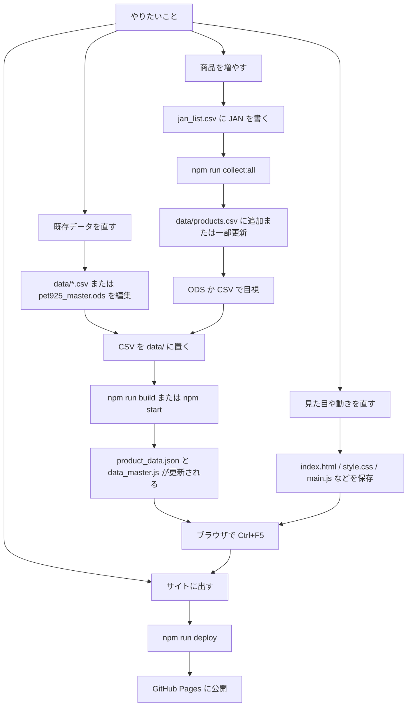

# pet925 管理マニュアル（現行仕様）

日々の運用手順です。言葉の意味は `docs/GLOSSARY.md`、なぜそう作ったかは `docs/PROJECT_SUMMARY.md`、AI に CSV を作らせるときのルールは `docs/AI_INSTRUCTIONS.md` を見てください。

---

## 1. 運用マップ

いまの正解はこれです。**集める作業**と**サイト用データにする作業**は別です。



### 役割の切り分け

| 役割 | 担当 | やること | やらないこと |
|---|---|---|---|
| **集める** | `auto_collect_all.py`（`npm run collect`） | JAN から商品名・画像・説明・タグを取る | サイト用 JSON は作らない（`collect:all` なら続けてビルドする） |
| **検品して配る形にする** | `csv_to_json.py`（`npm run build`） | CSV の検証、JSON / `data_master.js` の生成、`images/{JAN}` があれば採用 | ネットから画像は取らない |
| **画面で探す** | `main.js` + `search_worker.js` | 検索、フィルター、お気に入り、店員コメント | マスター CSV は読まない。ビルド済み JSON を読む |

### 何を直すか早見表

| やりたいこと | 触る場所 | そのあと |
|---|---|---|
| 商品を増やす | `jan_list.csv` | `npm run collect:all` → 目視 → 必要なら `npm run deploy` |
| 説明文・タグ・画像URLを直す | `data/products.csv`（または ODS の products） | `npm run build` |
| フィルターの名前を変える | `data/tags.csv` | `npm run build` |
| 「グレインフリー」などで自動タグを付ける | `data/rules.csv` | `npm run build` または次回の `collect` |
| 英語ブランド名でも日本語検索したい | `data/brands.csv` | `npm run build` |
| 店員コメントを足す | `data/comments.csv` | `npm run build` |
| 問い合わせメールを変える | `.env` の `CONTACT_EMAIL` | `npm run build` |
| 見た目 | `style.css` / `index.html` | 保存して Ctrl+F5 |
| 画面の動き | `main.js` | 保存して Ctrl+F5 |
| 検索の当たり方 | `search_worker.js` / `common.js` | 保存して Ctrl+F5 |
| 公開 | 変更が保存されていること | `npm run deploy` |

---

## 2. 日常の3ルート

### ルートA: 商品を増やす（推奨）

JANコードさえ分かれば、楽天 / Yahoo / Gemini が商品行を作ります。

1. プロジェクト直下の `jan_list.csv` を、**今回処理したい JAN だけ**に書き換える（見出し行は不要）。
   ```
   4902418002415
   4902418002439
   ```
2. ターミナルで `npm run collect:all` を実行する。
3. `data/products.csv` の末尾付近を開き、商品名・タグ・説明・画像を目視する。
4. 問題なければ `npm run deploy`。開発中の確認だけなら `npm start` のあとにブラウザで **Ctrl + F5**。

`npm run collect` だけだと CSV 更新までです。サイトに出す JSON は別途 `npm run build` が必要です。`collect:all` はその両方を一度にやります。

### ルートB: 既存データを直す

1. `data/*.csv` を直接編集する。または `data/pet925_master.ods` を直して CSV を書き出す（付録A）。
2. `npm run build`（または監視中なら `npm start` が自動で再ビルド）。
3. ブラウザで **Ctrl + F5**（IndexedDB が古いデータを持っているため）。
4. 公開するなら `npm run deploy`。

### ルートC: 見た目やプログラムを直す

1. `index.html` / `style.css` / `*.js` を保存する。
2. ブラウザで **Ctrl + F5**。
3. 検索ロジックを触った場合は `npm test` も実行する。
4. 公開するなら `npm run deploy`。

---

## 3. JANコードからの自動収集

担当は `auto_collect_all.py` です。必要な `.env` は §7 を見てください。

### 内部の順番

1. **楽天 Product Search API (v2)** … 商品名・メーカー・説明・価格・画像。透かしの少ない `r.r10s.jp` を最優先。
2. 失敗したら **楽天 Item Search API**。
3. それでも失敗したら **Yahoo!ショッピング API**（画像にショップロゴが入ることがある）。
4. `.env` に `GEMINI_API_KEY` があれば、説明文を約60字で生成する。無い場合でも、楽天から取れた情報だけで行は作れる。
5. `data/rules.csv` でタグを自動判定する。
6. `data/brands.csv` にメーカー名と一致する `key` があれば、収集時点の `brand` 列をその `name`（日本語など）にする。
7. `data/products.csv` に **新規追加**、または **既存 JAN の一部列を更新**する。最後に JAN 順へ並べ替えて保存する。

### 新規と更新の違い（重要）

`jan_list.csv` の JAN がすでに `products.csv` にある場合、**丸ごとスキップはしません。** 次の列だけ自動取得結果で上書きします。

- 上書きする: `name`, `brand`, `tags`, `desc`, `img`, `rak`, `rak_p`
- 残す: `size`, `amz`, `yah`, `a8`, `label`, `promo`, `amz_p`, `yah_p`, `exclude_tags`

手で直した説明文や画像を、同じ JAN で再収集すると戻ってしまいます。再収集する前に、その JAN をリストから外してください。

### `jan_list.csv` の注意

- 実行後に自動では空になりません。**次回は新しい JAN だけに書き換える。**
- 残したままでも動きますが、既存 JAN は上書き対象になるので処理時間と意図しない更新の元になります。

### 収集後に必ず目視する理由

自動の商品名・タグ・ブランドは完璧ではありません。`pet925_master.ods` か `products.csv` で直してから公開してください。

---

## 4. マスター CSV の編集

ビルドが読むのは `data/` 内の CSV です。`data_master.js` と `product_data*.json` は **ビルドが上書きするので手編集しない。**

不明な URL や値は `#` を入れます。

### products.csv（商品）

必須は16列。17列目 `exclude_tags` は任意です。

| 列 | 意味 |
|---|---|
| `name` | 商品名。画面表示と検索の最重要 |
| `brand` | **画面に出るブランド名そのもの**（ビルドでは変換しない） |
| `tags` | `tags.csv` の `key`。半角スペース区切り（例: `dog adult tear`） |
| `desc` | 説明文。検索対象 |
| `size` | 内容量。画面には出さないが検索には使う |
| `jan` | 13桁。お気に入り ID と画像キャッシュ名に使う |
| `img` | 画像 URL。`#` ならプレースホルダー |
| `amz` / `rak` / `yah` / `a8` | 各ショップや公式の URL。`#` なら商品名検索リンクを自動生成（`a8` は `#` のときボタン自体を出さない） |
| `label` / `promo` | 将来用。今は画面に出さない |
| `amz_p` / `rak_p` / `yah_p` | 価格。半角数字のみ。今は非表示 |
| `exclude_tags` | 自動タグ付けしたくない `key`。例: `appetite` |

`img` / `amz` / `rak` / `yah` / `a8` には **URL だけ**を入れてください。広告タグの HTML を丸ごと貼ると壊れます。

### tags.csv（フィルターボタン）

| 列 | 意味 | 例 |
|---|---|---|
| `category` | グループ。今は `animal` / `age` / `cond` のみ | `cond` |
| `key` | `products.csv` の tags に書く英単語 | `gf` |
| `name` | ボタンの表示名 | `穀物不使用 (GF)` |

- **animal**: 犬・猫。単一選択
- **age**: 年齢。単一選択
- **cond**: こだわり・お悩み。複数選択可

未登録の `key` を商品に書くと、ビルドがエラーで止まります。古いカテゴリ名 `pref` は使いません。

### rules.csv（自動タグ）

商品名・説明文にキーワードがあれば、そのタグを自動で付けます。

| 列 | 例 |
|---|---|
| `tag` | `gf` |
| `keywords` | `グレインフリー 穀物不使用` |

区切りはスペース・カンマ・読点どれでも構いません。判定は収集時とビルド時の両方で行われます。特定商品だけ付けたくないタグは `exclude_tags` へ。

### brands.csv（検索用の別名）

| 列 | 意味 | 例 |
|---|---|---|
| `key` | 英語名など（小文字で照合） | `nutro` |
| `name` | 日本語での呼び方 | `ニュートロ` |

いまの動き:

- **画面の表示**は `products.csv` の `brand` 列のままです。ビルドは日本語に自動変換しません。
- **検索**では `key` と `name` の両方にヒットします（`nutro` でも「ニュートロ」でも見つかる）。
- **収集時**だけ、メーカー名が `key` と一致すれば `brand` 列を `name` にします。

未登録ブランドでもビルドは止まりません。日本語検索を安定させたいときだけ追加してください。

### categories.csv（フィルターの枠）

| 列 | 意味 |
|---|---|
| `key` | `animal` など |
| `jp` / `en` | 見出し |
| `type` | `single` または `multi` |

通常は既存の3行を触らなくて大丈夫です。

### comments.csv（店員コメント）

検索結果に出す一言です。商品レビューではありません。ビルドは中身を検証せず、そのまま `data_master.js` の `comments` に載せます。

| 列 | 意味 | 例 |
|---|---|---|
| `category` | `animal` / `cond` / `keyword` | `cond` |
| `key` | タグ ID、または検索語 | `tear` / `心臓` |
| `comment` | 本文 | `涙やけの相談は本当に多いです...` |

表示ロジックは `comment_logic.js` です。

- `animal` / `cond`: 選んでいるタグから最大2件（`pickStoreComments`）。cond が無ければ animal にフォールバック。
- `keyword`: 検索欄の文字に `key` が部分一致したら、上記に **追加で最大1件**（`pickKeywordComments`）。

---

## 5. 画像

**取得は収集スクリプトの仕事です。ビルドは取得しません。**

優先順位は §3 と同じです（楽天 v2 → 楽天 Item → Yahoo）。

ビルド（`csv_to_json.py`）がやるのは次だけです。

- `images/{13桁JAN}.jpg`（または jpeg / png / webp / gif）がプロジェクト直下の `images/` にあれば、それを `img` より優先する。

画像が `#` のままでもビルドは成功します。画面側が「No Image」の SVG を出します。

直し方:

1. 正しい URL を `img` 列に貼る。
2. または `images/4902418002415.jpg` のように置く。
3. `npm run build`。

ブックマークレットは現行リポジトリにありません。画像の正攻法は JAN 収集か、URL の手貼りです。

楽天 API 経由の画像は直リンク（自サーバーへ複製しない）です。アフィリエイト提携は停止中ですが、画像の出典は楽天市場のカタログです。

---

## 6. 価格とショップリンク

- 価格列は画面に出していません。残しておいて構いませんが、半角数字のみ（カンマ禁止）。不明なら `0` または `#`。
- `amz` / `rak` / `yah` が `#` のとき、画面は「ブランド名＋商品名」で各モールの検索ページへ飛ばします。JAN では検索しません。
- ボタン文言は「Amazonで検索」「楽天市場で検索」「Yahoo!ショッピングで検索」です。
- **アフィリエイト ID は空が正しい状態です。** `main.js` の `AFFILIATE_CONFIG` は空文字のままにしてください。公開前に「ID が入っているか」を確認する必要はありません。

---

## 7. `.env` の設定

`.env` は Git に上げません。プロジェクト直下に置き、次のキーを使います。値はここに書かないでください。

| キー | 使うとき |
|---|---|
| `RAKUTEN_APP_ID` | JAN 収集（必須） |
| `RAKUTEN_ACCESS_KEY` | JAN 収集（必須） |
| `YAHOO_CLIENT_ID` | 楽天が失敗したときの画像・商品フォールバック |
| `GEMINI_API_KEY` | 説明文の自動生成（任意）。Google AI Studio で発行 |
| `CONTACT_EMAIL` | 利用規約モーダルの問い合わせリンク。ビルド時に文字コード配列へ変換される |

問い合わせ文面そのものは `index.html` のモーダル内です。提携状況や免責を変えるときはそこを直接編集します。

AI に商品 CSV を手で作らせるときは、`docs/AI_INSTRUCTIONS.md` をプロンプトとして渡してください。日常の増やす作業はルートA（JAN 収集）の方が確実です。

補助ツール:

- `csv_helper.html` … 1行分の CSV を手で作る入力補助
- `python3 auto_data_collector.py [商品URL]` … URL から1件分の CSV 行を出す旧経路。通常は `collect:all` で足りる

---

## 8. 開発中の確認

```bash
npm start          # data/*.csv の変更を監視して自動ビルド
npm run build      # 1回だけビルド（不備があると終了コード 1）
npm test           # normalize と店員コメントのユニットテスト
```

ブラウザで見るとき:

- 反映されない → **Ctrl + F5**（IndexedDB とファイルキャッシュの両方を捨てる）
- 実行ボタンの表示:
  - 読み込み中: `データを読み込み中... 42%`
  - 準備OK: `全123件を表示`
  - 条件入力後: `45件を表示`
  - 失敗: `エラー: データの読み込みに失敗しました`
- `file://` で HTML を直接開くと Worker や計測が制限されることがあります。ローカル確認は簡易サーバー経由が安定です。

---

## 9. 公開

```bash
npm run deploy
```

中身は「ビルド → `git add .` → commit → `git push`」です。ビルドでデータ不備があると push まで進みません。

独自ドメインの手順は `README.md` の「カスタムドメインの導入手順」です。ドメインを変えたら `index.html` の canonical と `main.js` の `authorizedDomains` を更新します。お気に入り（localStorage）はドメインが変わると消えます。

### 公開前チェック

**データと機能**

- [ ] `npm run build` がエラーなく終わる
- [ ] 実行ボタンが `全N件を表示` になり、件数が見積もりと合う（`データを読み込み中...` のままなら Worker 失敗）
- [ ] 犬 / 猫 / 涙やけなどフィルターが効く。cond は複数選択できる
- [ ] 「ニュートロ」「ねこ」「ネコ」など表記ゆれで検索できる
- [ ] 0件のとき `NO PRODUCTS FOUND` が出る
- [ ] お気に入りの追加・解除、件数、一括解除モーダル
- [ ] ショップボタンが新しいタブで開き、「○○で検索」になっている。アフィリエイト ID は空でよい
- [ ] URL が `#` の商品でも、商品名検索のページへ飛ぶ
- [ ] 画像。無い商品は No Image になる

**見た目**

- [ ] PC とスマホでカードが崩れない
- [ ] ヘッダー導入文が出ている

**健全性**

- [ ] F12 コンソールに赤いエラーが無い
- [ ] `product_data.json` の `total` が最新件数
- [ ] コンソールにコピー抑制の警告（STOP!）が出る

---

## 10. トラブルシューティング

| 症状・メッセージ | 見ること |
|---|---|
| `products.csv が見つかりません` | `data/products.csv` があるか。ファイル名末尾の空白、`products (1).csv` の混入 |
| `未登録タグ 'xxx'` | `tags.csv` に無い `key` を商品に書いている。追加するか tags 列を直す |
| `列が足りません` | 16列そろっているか。広告 HTML の貼りすぎで列が崩れていないか |
| `JANコード '…' が重複しています` | 同じ13桁が2行ある |
| `商品名 '…' が重複しています` | 同じブランド＋同じ名前。別名にするか行を削除 |
| `JANコードが標準的な13桁ではありません`（警告） | ビルドは通るが画像キャッシュ名に使えない |
| `価格 amz_p は半角数字のみ` | カンマや「円」を消す |
| ボタンが `データを読み込み中` のまま / `データの読み込みに失敗` | まず `npm run build`。コンソールの `Worker data load failed` は `product_data.json` が古い・無い |
| 直したのに画面が変わらない | Ctrl+F5。`npm start` が動いているか |
| CSV を上書きできない | LibreOffice を閉じる。`data/.~lock.products.csv#` を消す |
| 権限エラー（Linux） | `sudo chown $USER:$USER data/products.csv` |
| お気に入りが消えた | ドメインやブラウザを変えると localStorage は別物 |
| GA4 のリアルタイムにしか出ない | 標準レポートは 24〜48 時間遅れる |

ブランド未登録でビルドが止まる、ということは **今はありません。** 日本語検索を足したいときだけ `brands.csv` を更新します。

CSV 保存時に「テキスト形式で保存しますか？」と出たら **はい** です。

---

## 11. GA4 の推奨設定

1. 「管理 > データ収集と修正 > データの保持」を **14ヶ月** にする（初期値は2ヶ月）。
2. 「管理 > データ表示 > カスタム定義」でパラメータ `item_label` を登録する。`search_no_results` などの具体的な単語が見えるようになります。

ローカル（`localhost` / `file://`）では Cookie を切っています。本番ドメインでの確認が正確です。

---

## 12. 開発環境のセットアップ

Node.js と Python 3 が必要です。

```bash
sudo apt install nodejs npm python3-requests
npm install
python3 --version
npm run build
npm test
```

Python ライブラリの入れ方の選択肢:

- 推奨（システム）: `sudo apt install python3-requests`
- 仮想環境: `python3 -m venv venv && source venv/bin/activate && pip install requests`

セットアップ後は §2 のルートAから使えます。

---

## 付録A. LibreOffice（ODS）からの CSV 書き出し

`data/pet925_master.ods` で表をまとめ、シート名と同じ CSV を `data/` に出す運用です。必須シートは `products`, `tags`, `brands`, `categories`, `rules` です。

`comments.csv` はビルドが自動で読む追加マスターです。ODS に `comments` シートを足して一緒に書き出しても構いません。マクロの必須チェックには入っていないので、CSV を直接編集しても問題ありません。

マクロの登録:

1. [ツール] > [マクロ] > [マクロを管理] > [LibreOffice Basic]
2. 下の `ExportAllSheetsToCSV` / `ExportCurrentSheetOnly` / `CheckMandatoryFields` / `SyncBrandToMaster` を登録する
3. [ツール] > [カスタマイズ] > [ツールバー] から `ExportAllSheetsToCSV` をボタンにする
4. ODS は `data/` に保存する（書き出し先が同じフォルダになる）
5. `npm start` が CSV 変更を検知して再ビルドする

Google スプレッドシートの場合は [ファイル] > [ダウンロード] > [CSV] で `data/` の各ファイルへ上書きします。貼り付け後は「テキストを列に分割」を使ってください。

Calc へ CSV を貼るとき:

1. A1 を選んで貼り付け
2. 区切りは **コンマのみ**、テキストの区切りは `"`
3. `.ods` で保存する

```basic
Sub ExportAllSheetsToCSV
    Dim oDoc As Object, oSheets As Object, oSheet As Object
    Dim sURL As String, sPath As String
    Dim args(2) As New com.sun.star.beans.PropertyValue
    Dim aParts() As String
    
    oDoc = ThisComponent

    If oDoc.isModified Then
        If MsgBox("ファイルに変更があります。保存してから実行しますか？", 4 + 32, "確認") = 6 Then oDoc.store()
    End If

    If (oDoc.URL = "") Then
        MsgBox "エラー: ファイルが保存されていません。" & Chr(13) & _
               "先に一度ファイルを保存してから実行してください。", 16, "実行失敗"
        Exit Sub
    End If

    aParts = Split(oDoc.URL, "/")
    aParts(UBound(aParts)) = ""
    sPath = Join(aParts, "/")

    oSheets = oDoc.Sheets
    
    Dim requiredSheets As Variant, sNameCheck As String
    requiredSheets = Array("products", "tags", "brands", "categories", "rules")
    For Each sNameCheck In requiredSheets
        If Not oSheets.hasByName(sNameCheck) Then
            MsgBox "エラー: シート '" & sNameCheck & "' が見つかりません。", 16, "実行失敗"
            Exit Sub
        End If
    Next sNameCheck

    args(0).Name = "Overwrite"
    args(0).Value = True
    args(1).Name = "FilterName"
    args(1).Value = "Text - txt - csv (StarCalc)"
    args(2).Name = "FilterOptions"
    args(2).Value = "44,34,76,1,,0,false,true,true"

    Dim i As Long
    For i = 0 To oSheets.Count - 1
        oSheet = oSheets.getByIndex(i)
        sName = oSheet.Name

        If Not CheckMandatoryFields(oSheet, sName) Then
            MsgBox sName & " シートに不備があるため、書き出しを中断しました。", 48, "エラー"
            Exit Sub
        End If

        If oSheet.IsVisible Then
            oDoc.CurrentController.setActiveSheet(oSheet)
            sURL = sPath & sName & ".csv"
            oDoc.storeToURL(sURL, args)
        End If
    Next i
    
    MsgBox "全てのバリデーションをクリアし、CSVの一括出力が完了しました！", 64, "完了"
End Sub

Sub ExportCurrentSheetOnly
    Dim oDoc As Object, oSheet As Object
    Dim sURL As String, sPath As String
    Dim args(2) As New com.sun.star.beans.PropertyValue
    Dim aParts() As String

    oDoc = ThisComponent
    oSheet = oDoc.CurrentController.ActiveSheet
    
    If Not CheckMandatoryFields(oSheet, oSheet.Name) Then Exit Sub

    aParts = Split(oDoc.URL, "/")
    aParts(UBound(aParts)) = ""
    sPath = Join(aParts, "/")

    args(0).Name = "Overwrite" : args(0).Value = True
    args(1).Name = "FilterName" : args(1).Value = "Text - txt - csv (StarCalc)"
    args(2).Name = "FilterOptions" : args(2).Value = "44,34,76,1,,0,false,true,true"

    sURL = sPath & oSheet.Name & ".csv"
    oDoc.storeToURL(sURL, args)

    MsgBox "[" & oSheet.Name & ".csv] のみ出力しました。", 64, "完了"
End Sub

Function CheckMandatoryFields(oSheet As Object, sName As String) As Boolean
    Dim i As Long, col As Integer
    Dim mandatoryCols As Variant
    Dim sNameLower As String
    
    sNameLower = LCase(sName)

    If sNameLower = "products" Then
        mandatoryCols = Array(0, 1, 2)
    ElseIf sNameLower = "tags" Then
        mandatoryCols = Array(0, 1, 2)
    ElseIf sNameLower = "brands" Then
        mandatoryCols = Array(0, 1)
    ElseIf sNameLower = "categories" Then
        mandatoryCols = Array(0, 1, 2, 3)
    Else
        mandatoryCols = Array()
    End If

    i = 1
    Do
        If oSheet.getCellByPosition(0, i).String = "" Then Exit Do
        
        For Each col In mandatoryCols
            If oSheet.getCellByPosition(col, i).String = "" Then
                MsgBox "[" & sName & "] シートの " & (i + 1) & " 行目、" & _
                       Chr(65 + col) & " 列目が空欄です。入力してください。", 16, "入力エラー"
                CheckMandatoryFields = False
                Exit Function
            End If
        Next col
        i = i + 1
        If i > 10000 Then Exit Do
    Loop
    CheckMandatoryFields = True
End Function

Sub SyncBrandToMaster(oEvent As Object)
    On Error GoTo ErrorHandler
    
    Dim oDoc As Object, oSheets As Object, oSheet As Object, oTargetSheet As Object
    Dim startRow As Long, endRow As Long, startCol As Long, endCol As Long
    Dim iRow As Long, i As Long, bExists As Boolean
    Dim sValue As String, oCell As Object, oCellName As Object

    Static sProcessedBrands As String
    Static sProcessedTags As String

    oDoc = ThisComponent
    oSheets = oDoc.Sheets

    If oEvent.supportsService("com.sun.star.sheet.SheetCell") Then
        startRow = oEvent.CellAddress.Row : endRow = startRow
        startCol = oEvent.CellAddress.Column : endCol = startCol
        oSheet = oSheets.getByIndex(oEvent.CellAddress.Sheet)
    ElseIf oEvent.supportsService("com.sun.star.sheet.SheetCellRange") Or _
           oEvent.supportsService("com.sun.star.table.CellRange") Then
        startRow = oEvent.RangeAddress.StartRow : endRow = oEvent.RangeAddress.EndRow
        startCol = oEvent.RangeAddress.StartColumn : endCol = oEvent.RangeAddress.EndColumn
        oSheet = oSheets.getByIndex(oEvent.RangeAddress.Sheet)
    Else
        Exit Sub
    End If

    If oSheet.Name <> "products" Then Exit Sub

    sProcessedBrands = "|" 
    sProcessedTags = "|"

    For iRow = startRow To endRow
        If iRow = 0 Then GoTo NextRow

        If startCol <= 1 And endCol >= 1 Then
            sValue = Trim(oSheet.getCellByPosition(1, iRow).String)
            If sValue <> "" And sValue <> "brand" And sValue <> "ブランド" And sValue <> "#" And InStr(sProcessedBrands, "|" & sValue & "|") = 0 Then
                oTargetSheet = oSheets.getByName("brands")
                bExists = False
                i = 1
                
                Do While i < 5000
                    oCell = oTargetSheet.getCellByPosition(0, i)
                    oCellName = oTargetSheet.getCellByPosition(1, i)
                    
                    If LCase(Trim(oCell.String)) = LCase(sValue) Or LCase(Trim(oCellName.String)) = LCase(sValue) Then
                        bExists = True
                        Exit Do
                    End If
                    
                    If oCell.String = "" And oCellName.String = "" Then Exit Do
                    i = i + 1
                Loop

                If Not bExists Then
                    If MsgBox("新ブランド '" & sValue & "' を brands シートに登録しますか？", 4 + 32, "クイック追加") = 6 Then
                        Dim sKey As String, sBrandName As String
                        sKey = LCase(InputBox("システム用ID (半角英数):", "1/2 ステップ", sValue))
                        If sKey <> "" Then
                            sBrandName = InputBox("サイトでの表示名:", "2/2 ステップ", sValue)
                            oTargetSheet.getCellByPosition(0, i).String = sKey
                            oTargetSheet.getCellByPosition(1, i).String = sBrandName
                        End If
                    End If
                    sProcessedBrands = sProcessedBrands & sValue & "|"
                End If
            End If
        End If

        If startCol <= 2 And endCol >= 2 Then
            sValue = Trim(oSheet.getCellByPosition(2, iRow).String)
            If sValue <> "" And sValue <> "tags" And sValue <> "タグ" Then
                Dim aTags() As String, sTag As String
                aTags = Split(Replace(Replace(sValue, ",", " "), "　", " "), " ")
                oTargetSheet = oSheets.getByName("tags")
                For Each sTag In aTags
                    sTag = Trim(sTag)
                    If Len(sTag) > 1 And InStr(sProcessedTags, "|" & sTag & "|") = 0 Then
                        bExists = False
                        i = 1
                        Do While i < 5000
                            oCell = oTargetSheet.getCellByPosition(1, i)
                            If LCase(Trim(oCell.String)) = LCase(sTag) Then
                                bExists = True
                                Exit Do
                            End If
                            If oCell.String = "" And oTargetSheet.getCellByPosition(0, i).String = "" Then Exit Do
                            i = i + 1
                        Loop
                        If Not bExists Then
                            If MsgBox("新タグ '" & sTag & "' を tags シートに追加しますか？", 4 + 32, "タグクイック追加") = 6 Then
                                Dim sDisp As String
                                sDisp = InputBox("サイトでの表示名:", "タグ追加", sTag)
                                oTargetSheet.getCellByPosition(0, i).String = "cond"
                                oTargetSheet.getCellByPosition(1, i).String = sTag
                                oTargetSheet.getCellByPosition(2, i).String = sDisp
                            End If
                            sProcessedTags = sProcessedTags & sTag & "|"
                        End If
                    End If
                Next sTag
            End If
        End If
NextRow:
    Next iRow
    Exit Sub

ErrorHandler:
    Resume Next
End Sub
```
